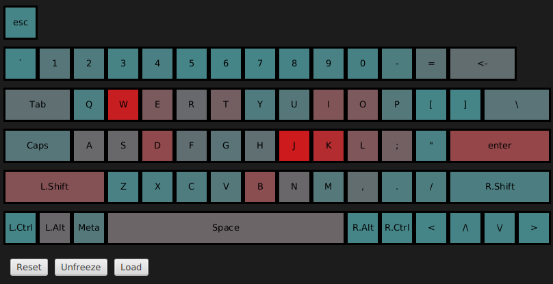

# Keyboard Heat Map

## Problem

Maybe you're a developer and you use the keyboard excessively for vimming. Maybe you are a hardcore gamer. Either way, if the shortcuts setup is suboptimal, your wrist might start to hurt.

To address this, I created a program that combines a minimalistic keylogger and an interface to visualize its output. It will help you setup your keyboard shortcuts as even as possible. You just leave it running for a work-session or two, pass the aggregated data to the GUI and adjust your setup accordingly.

There are 2 components in this repository: the keylogger and the graphical application to display the result.

P.S.
The keylogger only collects the number and the total time for each key, without saving information about the order.

If you don't trust the keylogger program, you can create a file "keylog.csv" yourself, the format is: evdev-keycode,number_of_presses,time_pressed

## Build

To build the keylogger you need `libevdev` installed.

`g++ linux_key_counter.cpp -o keylogger.out -l:libevdev.a`

To build the GUI app you need java 17 and maven. Run this in ./gui directory:

`maven clean javafx:run`

## Run

Running the keylogger requires root privileges.

`Usage: ./keylogger.out ./keylogger.out <path/to/device> KEY_<STOP>`

- <path/to/device>: /dev/input/event<x>, to get the <x> see `ls -l /dev/input/by-path/`
- KEY_<STOP>: key-press event that stops the program, for example KEY_F1

## Todo
- [x] Keylogger for X server
- [x] Keylogger for X and Wayland
- [x] Heat map generation from file
- [x] GUI: create keyboard layout
- [x] GUI: visualize the heat map
- [ ] Keylogger for Windows

